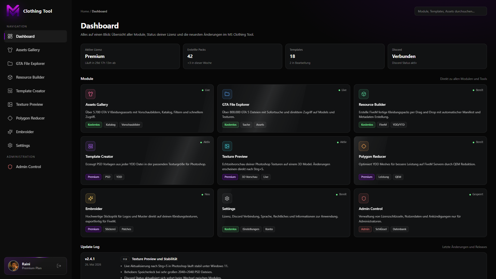

# MS Clothing Tool – Create and Manage Clothing  &nbsp;
Das MS Clothing Tool ermöglicht dir einen schnelleren Workflow rund um GTA5 / FiveM Clothing. Darunter zählt das ready machen von FiveM Kleidung, das erstellen von PSD Templates sowie die Änderungen und Bearbeitungen einer .psd-Datei Live auf einem Model im Tool anschauen zu können.

[**Discord**](https://discord.gg/XGauwG5uvC) **·** [**Download soon**](https://github.com/7Raini/MS-Clothing-Tool/releases/latest) **·** [**Report a Bug**](https://github.com/7Raini/MS-Clothing-Tool/issues)

---

##  &nbsp; Highlights

| | |
|---|---|
|  &nbsp; **GTA File Explorer** | Öffne alle files an einem Ort, ohne andere Tools verwenden zu müssen. |
|  &nbsp; **Live preview** | Siehe genau, wie deine Kleidung Ingame aussehen wird. |
|  &nbsp; **Polygon Reducer** | Reduziere hochpolygone Meshes in Sekundenschnelle auf spielbereite Polygoncounts. |
|  &nbsp; **Resource Builder** | Verwandle deine fertige Kleidung mit nur einem Klick in eine einsatzbereite FiveM-Ressource. |
|  &nbsp; **Texture Preview** | Speicher deine `.psd`-Datei und beobachte, wie sich die Textur im Viewer sofort aktualisiert. |
|  &nbsp; **Template Creator** | Erstelle in Sekundenschnelle ein sauberes `.psd`-Template aus einer `.ydd`-Datei. |
|  &nbsp; **Discord login** | Melde dich einmalig mit deinem Discord-Account an – keine zusätzlichen Maßnahmen. |

---

##  &nbsp; License-Keys - Preise

| | |
|---|---|
|  &nbsp; **Premium · 30 Tage** | 19,90€ - (inkl. Premium-Rolle für `30` Tage) |
|  &nbsp; **Premium · 90 Tage** | 49,90€ - (inkl. Premium-Rolle für `90` Tage) |
|  &nbsp; **Premium · Lifetime** | 189,90€ - (inkl. Premium-Rolle für `unbegrenzt` Tage) |
--- 

##  &nbsp; Features

### Assets Gallery `Free`
Über 5.700 GTA V Kleidungsassets mit Vorschaubildern, Katalog, Filtern und schnellerem Zugriff.

### GTA File Explorer `Free`
Über 800.000 GTA 5 Dateien mit Sofortsuche und direktem Zugriff auf Models und Texturen.

### Resource Builder `Free`
Erstelle FiveM fertige Kleidungspacks per Drag and Drop mit automatischer Manifest und Metadaten Erstellung.

### Template Creator `Premium`
Erzeugt PSD Vorlagen aus jeder YDD Datei in der passenden Texturgröße für Photoshop.

### Texture Preview `Premium`
Echtzeitvorschau deiner Photoshop Texturen auf einem 3D Model. Änderungen erscheinen direkt nach Strg+S.

### Polygon Reducer `Premium`
Optimiert YDD Meshes für bessere Leistung auf FiveM Servern durch QEM Reduktion.

### Embroider `Premium`
Hochwertige Stickoptik für Logos und Muster direkt auf deinen Kleidungstexturen, exportfertig für FiveM.

---

##  &nbsp; Installation
1. Open the [latest release](https://github.com/7Raini/MS-Clothing-Tool/releases/latest).
2. Download `MSClothingTool-<version>.zip`.
3. Right-click the ZIP → Properties → tick Unblock → OK.
4. Extract the contents to a folder you'd like to keep, for example `C:\Tools\MSClothingTool\`.
5. Run `MSClothingTool.exe`.
> **Windows SmartScreen:** on first launch Windows may show "Unrecognized app". Click More info → Run anyway. This is a normal warning for new applications and goes away as the app builds reputation.

---

##  &nbsp; Account & Premium

MS Clothing Tool uses Discord for authentication. Simply click the login button, authorize the application in your browser, and you're ready to go. We do not use separate accounts or passwords.

Premium unlocks the following features: **Template Creator**, **Texture Preview**, **Polygon Reducer** and **Embroider**.

> Premium licenses (license keys) are sold exclusively through our Discord server. To purchase one, simply open a ticket, choose a pricing plan (30 Days, 90 Days, Lifetime, or a custom license), and redeem the license key in the tool once you receive it.

Once your license key expires, Premium features will no longer be accessible until a new license key is redeemed.

---
